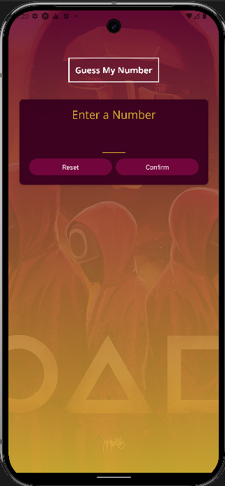
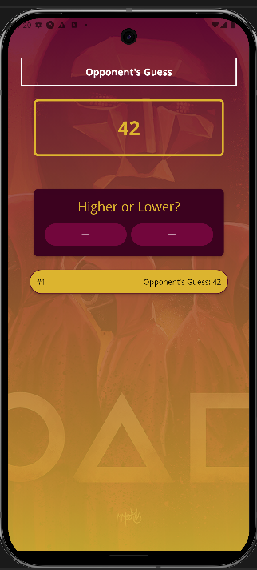
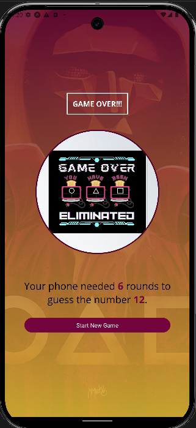

# Guess My Number Game

A simple React Native game app where users try to guess a randomly generated number based on hints from the app.

## Features

- **Start Screen**: Enter a number to start the game.
- **Game Screen**: Guess the number while receiving feedback.
- **Game Over Screen**: Displays results and allows restarting the game.
- **Custom Components**: Reusable UI components.
- **Splash Screen**: Configured via `app.json`.

## Prerequisites
- Node.js (v16 or higher recommended)
- Expo CLI (`npm install -g expo-cli`)
- A code editor (e.g., VS Code)
- A device/emulator with Expo Go installed

## Installation
1. Clone the repository:
   ```bash
   git clone https://github.com/HariPrayudha/Guess-My-Number-Game.git
   ```
2. Navigate to the project directory:
   ```bash
   cd Guess-My-Number-Game
   ```
3. Install dependencies:
   ```bash
   npm install
   ```

## Running the Project
1. Start the development server:
   ```bash
   npm start
   ```
2. Scan the QR code in the terminal using the **Expo Go** app on your device or run the project on an emulator.

## Usage

1. Run the app on an emulator or a physical device using Expo Go.
2. Follow the on-screen instructions to play the game.

## Configuration
### app.json
The `app.json` file includes the configuration for:
- Splash screen
- App icons
- Adaptive icons for Android

```json
{
  "expo": {
    "name": "Guess-My-Number-Game",
    "slug": "Guess-My-Number-Game",
    "version": "1.0.0",
    "orientation": "portrait",
    "icon": "./assets/icon.png",
    "userInterfaceStyle": "light",
    "splash": {
      "image": "./assets/splash-icon.png",
      "resizeMode": "contain",
      "backgroundColor": "#ffffff"
    },
    "android": {
      "adaptiveIcon": {
        "foregroundImage": "./assets/adaptive-icon.png",
        "backgroundColor": "#ffffff"
      }
    }
  }
}
```

## Screenshots

<table>
  <tr>
    <td></td>
    <td></td>
    <td></td>
  </tr>
  <tr>
    <td>Start Screen</td>
    <td>Game Screen</td>
    <td>Game Over Screen</td>
  </tr>
</table>

## Contributions
Contributions are welcome! Feel free to fork the repository and submit a pull request with your improvements.

## License

This project is licensed under the MIT License.

### Author

**Hari Prayudha**

- [GitHub Profile](https://github.com/HariPrayudha)
- [LinkedIn](https://www.linkedin.com/in/hari-prayudha)


Enjoy playing **Guess My Number Game**!
